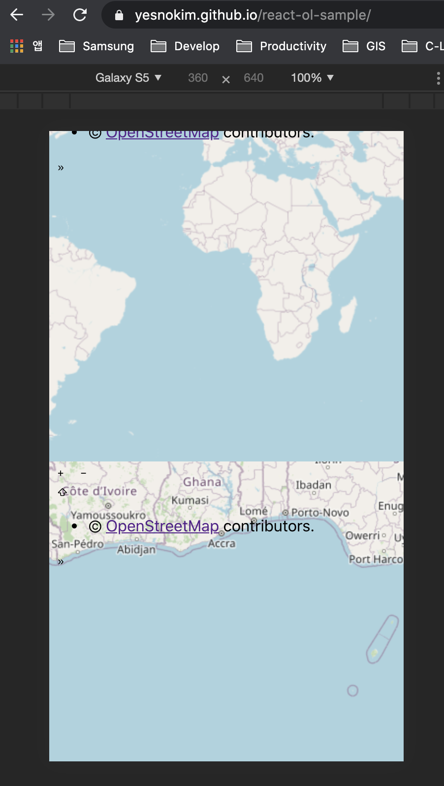

openLayer-OSM을 github에 hosting 해보기

1. Create react app
```shell
$npx create-react-app olsample
```

2. openlayer install (npm)
https://www.npmjs.com/package/ol
```shell
$npm install --save ol
```

3. add github dependancy
```shell
$ npm install gh-pages --save-dev
```

4. add git upstream and deploy

5.https://yesnokim.github.io/react-ol-sample/

